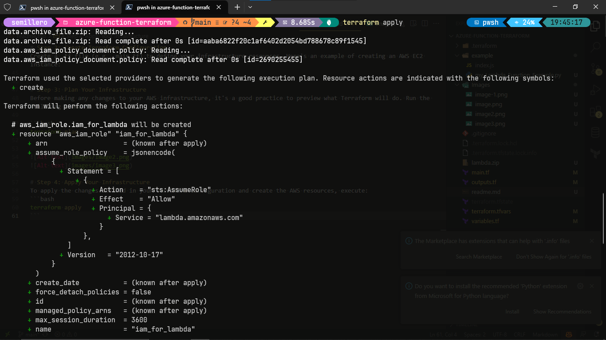
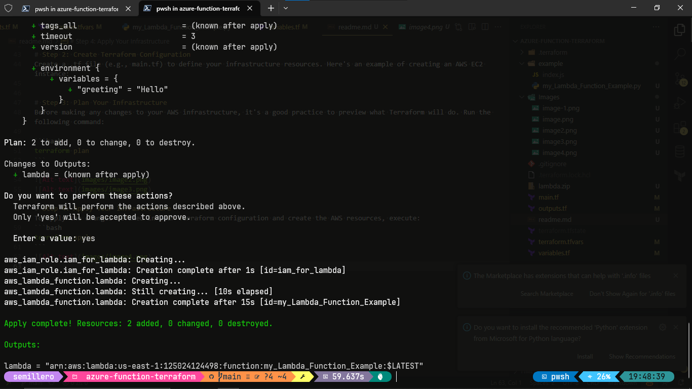
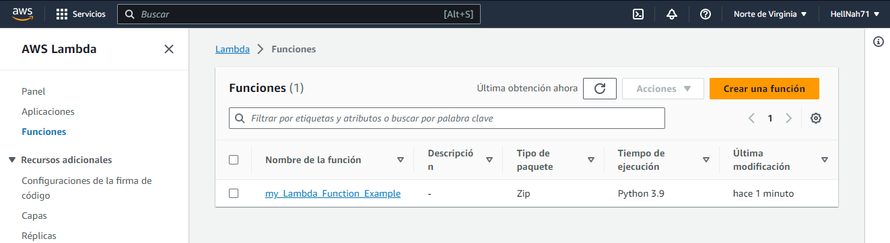
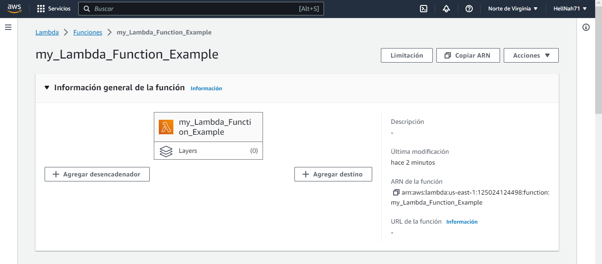
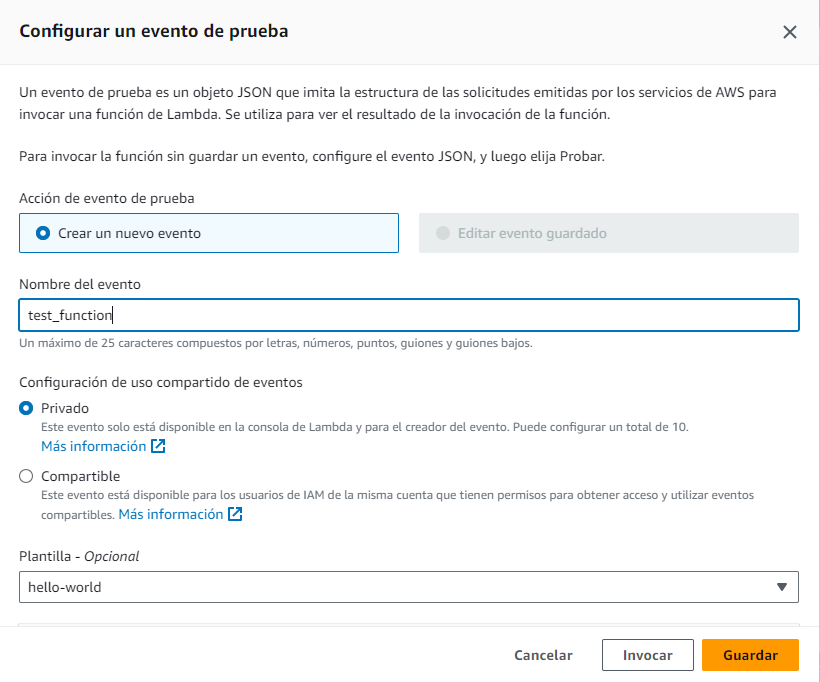
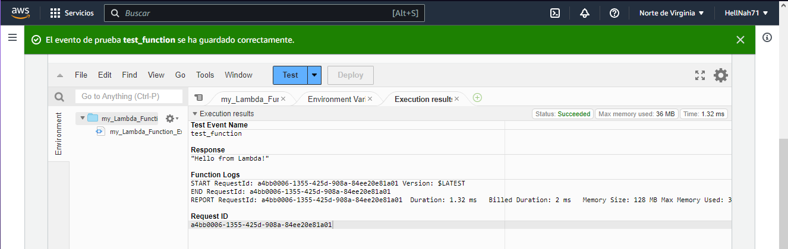

# Terraform Basics with AWS

🚀 Welcome to this introductory guide on using Terraform with AWS. In this README, we'll cover the essential commands: `terraform init`, `terraform plan`, and `terraform apply`.


## Table of Contents

- [Introduction to Terraform](#introduction-to-terraform)
- [Prerequisites](#prerequisites)
- [Getting Started](#getting-started)
  - [Step 1: Initialize Terraform](#step-1-initialize-terraform)
  - [Step 2: Create Terraform Configuration](#step-2-create-terraform-configuration)
  - [Step 3: Plan Your Infrastructure](#step-3-plan-your-infrastructure)
  - [Step 4: Apply Your Infrastructure](#step-4-apply-your-infrastructure)
- [Conclusion](#conclusion)

## Introduction to Terraform

🛠️ [Terraform](https://www.terraform.io/) is an open-source Infrastructure as Code (IaC) tool developed by HashiCorp. It allows you to define and provision infrastructure resources using a declarative configuration language. Terraform supports multiple cloud providers, including AWS, Azure, Google Cloud, and more.

## Prerequisites

Before you begin, ensure that you have the following prerequisites installed and configured:

- [Terraform](https://www.terraform.io/downloads.html)
- [AWS CLI](https://aws.amazon.com/cli/)
- AWS IAM credentials with appropriate permissions.

## Getting Started

🏁 Let's walk through the basic steps to use Terraform with AWS.

### Step 1: Initialize Terraform

🚀 When starting a new Terraform project or working with an existing one, the first step is to initialize Terraform. This command downloads the necessary provider plugins and modules.

```bash
terraform init

```


# Step 2: Create Terraform Configuration
⚙️ Create a .tf file (e.g., main.tf) to define your infrastructure resources. Here's an example of creating an AWS EC2 instance:


# Step 3: Plan Your Infrastructure
📝 Before making any changes to your AWS infrastructure, it's a good practice to preview what Terraform will do. Run the following command:

```bash
terraform plan
```


# Step 4: Apply Your Infrastructure
🚧 To apply the changes defined in your Terraform configuration and create the AWS resources, execute:
```bash
terraform apply
```
Terraform will prompt for confirmation. Type yes to proceed. It will then provision the resources as specified in your configuration.







